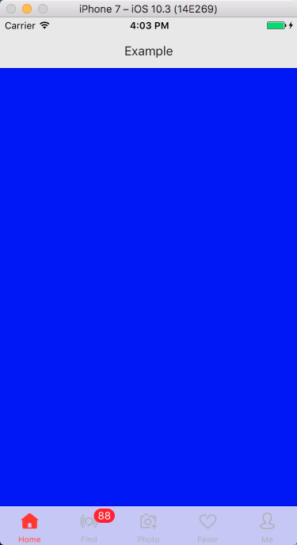

# ESTabBarControllerDemo
demo according from  [https://github.com/eggswift/ESTabBarController](https://github.com/eggswift/ESTabBarController)

**tabbar 可以做的很炫(elegant), 比如可以设置点击有animation的动态，中间是个大圆图，  
消息提醒可以抖动弹出，tabItem发现新版本提醒。如果可以换肤(像手淘)，  
那么tabbar的资源由皮肤factory统一输出。以上诉求GitHub已有 [ESTabBarController](https://github.com/eggswift/ESTabBarController) Star > 1,869 。 demo 图：**  
  
按照[ESTabBarController](https://github.com/eggswift/ESTabBarController) 教程把动态图和消息提醒，消息消失整合为一个空的工程。用pod引入依赖有问题，所以工程copy了一份源码。   

